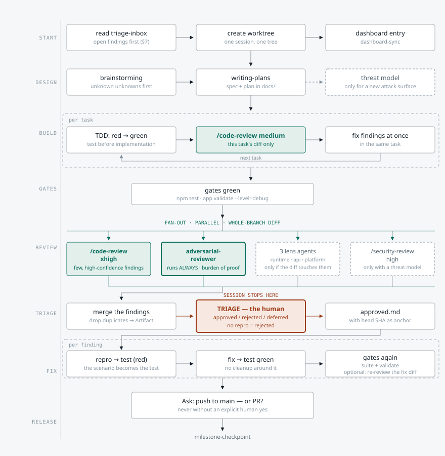

# Milestone Cycle

*English · [Deutsche Version](MILESTONE-CYCLE.md)*

**As of: 0.1.33** — the framework version in which the flow drawn here last changed. If that
differs from the current `plugin.json`, nothing is wrong: the flow has not changed since. If the
*flow* differs, this file is stale — see [Maintenance](#maintenance).

This file shows the cycle of a milestone from the first second to the checkpoint. It is the
detail view of the "Milestone loop · days" line in the [structure diagram](assets/struktur.en.svg)
in the README — one line there, eight bands here.

The flow itself is **not defined here.** It emerges from rules spread across several files; which
ones, for each step, is listed under [Where each step is defined](#where-each-step-is-defined).
This picture is a derivative — where they disagree, the source wins, not the drawing.

Green marks the two review points, red the single spot where the session stops and waits for a
human, dashed everything that only runs under a condition.

## Two reviews, not one

This is the part of the flow most easily confused. There are two review points at different
levels, and they do different jobs.

- **`/code-review medium` — per task, inside the build loop.** It sees only that one task's diff,
  reports few and confident findings, and those get fixed right away in the same task. No lenses,
  no gate — otherwise the session would stop at every task.
- **The fan-out at the end — once, on the whole branch diff.** Here `/code-review xhigh` and the
  `adversarial-reviewer` run at the same time, plus whichever lenses the diff actually touches.
  Only here is there a triage gate, because only here does enough accumulate for sorting to pay
  off.
- **The adversarial run is the only one that runs unconditionally.** The three lenses ask "does
  the diff touch timers / HTTP / paths?" — it asks nothing, because its search space has no file
  extension. In exchange it reports only what it can back with a repro scenario.

## Why the gate is what makes the fix loop possible

Without triage the lens would have to decide for itself what counts as a real bug — and would be
forced to play safe.

- **The stop is a feature.** Because a human sorts every finding individually into `approved`,
  `rejected` or `deferred`, the lens is free to search aggressively. A finding without a
  reproducible scenario is thrown out without discussion — that keeps triage at minutes rather
  than hours.
- **The `head` SHA is the expiry stamp.** The release file carries the commit the triage was done
  against. If it differs from `git rev-parse HEAD` at fix time, the release is stale — otherwise
  some session eventually fixes findings that were judged against a different state of the code.
- **Fixes go test-first.** The repro scenario from the finding is the test that gets written
  first and has to be red. That way no fix can be called "done" without something measuring the
  difference.
- **`deferred` does not disappear.** Deferred findings move into the `triage-inbox`, which every
  new milestone session reads first — that is the return path at the top of the diagram.

## Where each step is defined

Shorthands for the paths in the table:

| Shorthand | Path |
|---|---|
| `CLAUDE.md §N` | `plugin/skills/agentic-loop-framework/templates/CLAUDE.md`, section N |
| `agents/` | `plugin/skills/agentic-loop-framework/templates/.claude/agents/` |
| `checkpoint` | `plugin/skills/agentic-loop-framework/templates/.claude/skills/milestone-checkpoint/SKILL.md` |
| `SKILL.md` | `plugin/skills/agentic-loop-framework/SKILL.md` (bootstrap; "Standing rules" at the end) |
| `sp:` | external Superpowers skill, not in this repo |

| Band | Step in the diagram | Defined in | What the source fixes |
|---|---|---|---|
| START | read triage-inbox | `CLAUDE.md §7` | New milestone sessions read the inbox **first** |
| START | create worktree | `CLAUDE.md §9` → "Starting" | One session, one worktree; native paths first |
| START | dashboard entry | `CLAUDE.md §7`, `SKILL.md` standing rules | Keep the entry current every session; `FRICTION:` at once |
| DESIGN | brainstorming | `CLAUDE.md §0`, `§1` | Mandatory before feature/design work; unknown unknowns first |
| DESIGN | writing-plans | `CLAUDE.md §0`, `§4` | Spec + plan before multi-step changes; DONE conditions |
| DESIGN | threat model (conditional) | `CLAUDE.md §5` | Only for a new attack surface; `sp:security-requirement-extraction` |
| BUILD | "per task" loop | `CLAUDE.md §0` | `sp:subagent-driven-development`, else `sp:executing-plans` |
| BUILD | TDD red → green | `CLAUDE.md §0`, `§4` | Test before implementation; known defects as `{ todo: true }` |
| BUILD | `/code-review medium` | `CLAUDE.md §9` step 1 | Level always explicit; `medium` is the task level |
| GATES | gates green | `CLAUDE.md §4`, `templates/.claude/hooks/test-gate.js` | A red suite blocks the commit; the commands are project-specific |
| REVIEW | parallel fan-out | `CLAUDE.md §9` step 1 | `sp:dispatching-parallel-agents` |
| REVIEW | `/code-review xhigh` | `CLAUDE.md §9` step 1 | `xhigh` is the whole-branch level |
| REVIEW | `adversarial-reviewer` | `CLAUDE.md §9` step 1, `agents/adversarial-reviewer.md` | Runs **always**; burden of proof, not a quota of findings |
| REVIEW | three lenses (conditional) | `CLAUDE.md §9` step 1, `agents/{runtime-resource,api-contract,cross-platform}-reviewer.md` | Only if the diff touches them |
| REVIEW | `/security-review high` | `CLAUDE.md §9` step 1, `§5` | Only with its own threat model |
| REVIEW | agent model + effort | `CLAUDE.md §11` → "Subagents" | `inherit`/`high`; `adversarial-reviewer` is the documented exception |
| TRIAGE | merge → Artifact | `CLAUDE.md §9` step 2 | Drop duplicates, publish, **stop** |
| TRIAGE | human triage | `CLAUDE.md §9` step 2 | `approved`/`rejected`/`deferred`; no repro means rejected |
| TRIAGE | `approved.md` + `head` SHA | `CLAUDE.md §9` step 2 | Validity anchor against `git rev-parse HEAD` |
| FIX | repro → test → fix | `CLAUDE.md §9` step 2, `§0` | `sp:test-driven-development`; the scenario becomes the test |
| FIX | gates again | `CLAUDE.md §4` | The same gates as above |
| RELEASE | push to main or PR? | `CLAUDE.md §9` step 3 | Two options, never without an explicit yes |
| RELEASE | `milestone-checkpoint` | `CLAUDE.md §7`, `checkpoint` | Its own `Mx.0` entry; nine steps |
| RELEASE | `deferred` → triage-inbox | `CLAUDE.md §7` | Return path; the next session reads it first |

Not in the diagram but in force through the same cycle: `CLAUDE.md §2`/`§3` (simplicity, surgical
changes) apply throughout, `§8` (versioning) only on a real release, `§10` (permissions)
underneath all of it.

## Maintenance

**This file is derived and goes stale silently.** It has no gate hook enforcing it — the
structure diagram in the README carried its `plugin.json` version wrongly across seventeen
releases because nobody updated it. Hence the rule:

**If any of these changes, this file is updated in the same session:**

- a section in `templates/CLAUDE.md` that appears in the mapping table — today §0, §4, §5, §7,
  §9, §11
- a lens agent is added to or removed from `templates/.claude/agents/`, or its run condition
  changes
- the step sequence in `milestone-checkpoint` changes
- a "standing rule" in `SKILL.md` changes in a way that shows up in the diagram

**What to do then:** update `assets/milestone-cycle.svg` **and** `assets/milestone-cycle.en.svg`,
the prose in both language versions, the mapping table, and the `As of:` stamp in the header. The
change belongs in the same CHANGELOG entry as the rule change that triggered it.

`milestone-checkpoint` covers this in step 7a, where it is anchored as an item on the framework
reconciliation checklist.

**The SVG files are the source of the drawing.** They are self-contained (fixed colors, no
external CSS, no font dependency beyond fallbacks) and render directly in a browser or on GitHub.
Embedding the drawing anywhere else creates a copy — changes go here first.

**Both language versions are equal in rank and are maintained together.** A change to one that
does not reach the other is a defect, not a backlog item: readers of the two versions would
otherwise follow different flows.
