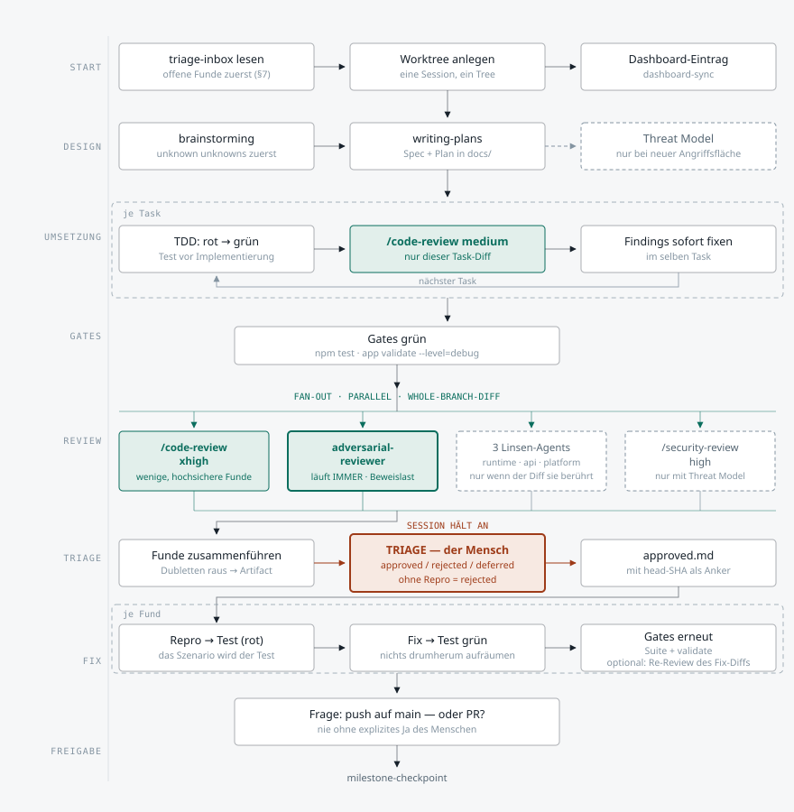

# Meilenstein-Zyklus

*Deutsch · [English version](MILESTONE-CYCLE.en.md)*

**Stand: 0.1.33** — die Framework-Version, in der der hier abgebildete Ablauf zuletzt geändert
wurde. Weicht sie stark von der aktuellen `plugin.json` ab, ist das kein Fehler: der Ablauf hat
sich seither nicht geändert. Weicht der *Ablauf* ab, ist diese Datei veraltet — siehe
[Pflege](#pflege).

Diese Datei zeigt den Zyklus eines Meilensteins von der ersten Sekunde bis zum Checkpoint. Sie
ist die Detailansicht der Zeile „Milestone-Loop · Tage" aus der
[Struktur-Grafik](assets/struktur.svg) im README — dort ist der Zyklus eine Zeile, hier sind es
acht Bänder.

Der Ablauf selbst ist **nicht hier definiert.** Er ergibt sich aus Regeln, die über mehrere
Dateien verteilt sind; welche das jeweils sind, steht in
[Wo jeder Schritt definiert ist](#wo-jeder-schritt-definiert-ist). Diese Grafik ist eine
Ableitung — bei Widerspruch gilt die Quelle, nicht das Bild.

Grün sind die beiden Review-Stellen, rot der einzige Punkt, an dem die Session anhält und auf
einen Menschen wartet, gestrichelt alles, was nur unter Bedingungen läuft.

## Zwei Reviews, nicht einer

Das ist die Stelle, die im Ablauf am leichtesten verwechselt wird. Es gibt zwei Review-Punkte auf
verschiedenen Ebenen, und sie haben verschiedene Aufgaben.

- **`/code-review medium` — pro Task, innerhalb der Umsetzung.** Sieht nur den Diff dieses einen
  Tasks, meldet wenige und sichere Funde, und die werden sofort im selben Task gefixt. Keine
  Linsen, kein Gate — sonst hielte die Session bei jedem Task an.
- **Der Fan-out am Ende — einmal, auf dem ganzen Branch-Diff.** Hier laufen `/code-review xhigh`
  und der `adversarial-reviewer` gleichzeitig, dazu die Linsen, die der Diff tatsächlich berührt.
  Erst hier gibt es ein Triage-Gate, weil erst hier genug zusammenkommt, dass eine Sortierung
  sich lohnt.
- **Der adversariale Lauf ist der einzige, der bedingungslos mitläuft.** Die drei Linsen fragen
  „berührt der Diff Timer / HTTP / Pfade?" — er fragt nichts, weil sein Suchraum keine
  Dateiendung hat. Dafür meldet er nur, was er mit einem Repro-Szenario belegen kann.

## Warum das Gate den Fix-Loop erst möglich macht

Ohne Triage müsste die Linse selbst entscheiden, was ein echter Bug ist — und wäre gezwungen,
vorsichtig zu sein.

- **Der Halt ist ein Feature.** Weil ein Mensch jeden Fund einzeln als `approved`, `rejected`
  oder `deferred` einsortiert, darf die Linse aggressiv suchen. Ein Fund ohne reproduzierbares
  Szenario fliegt ohne Diskussion raus — das hält die Triage bei Minuten statt Stunden.
- **Der `head`-SHA ist der Haltbarkeitsstempel.** Die Freigabedatei trägt den Commit, gegen den
  triagiert wurde. Weicht er beim Fixen von `git rev-parse HEAD` ab, ist die Freigabe veraltet —
  sonst fixt irgendwann eine Session Funde, die gegen einen anderen Codestand beurteilt wurden.
- **Gefixt wird test-first.** Das Repro-Szenario aus dem Fund ist der Test, der zuerst
  geschrieben wird und rot sein muss. Damit kann kein Fix „fertig" heißen, ohne dass etwas den
  Unterschied misst.
- **`deferred` verschwindet nicht.** Zurückgestellte Funde wandern in die `triage-inbox`, die
  jede neue Meilenstein-Session als Erstes liest — das ist der Rücklauf ganz oben im Diagramm.

## Wo jeder Schritt definiert ist

Kurzformen für die Pfade in der Tabelle:

| Kürzel | Pfad |
|---|---|
| `CLAUDE.md §N` | `plugin/skills/agentic-loop-framework/templates/CLAUDE.md`, Abschnitt N |
| `agents/` | `plugin/skills/agentic-loop-framework/templates/.claude/agents/` |
| `checkpoint` | `plugin/skills/agentic-loop-framework/templates/.claude/skills/milestone-checkpoint/SKILL.md` |
| `SKILL.md` | `plugin/skills/agentic-loop-framework/SKILL.md` (Bootstrap; „Standing rules" am Ende) |
| `sp:` | externer Superpowers-Skill, nicht in diesem Repo |

| Band | Schritt im Diagramm | Definiert in | Was die Quelle festlegt |
|---|---|---|---|
| START | triage-inbox lesen | `CLAUDE.md §7` | Neue Meilenstein-Sessions lesen die Inbox **zuerst** |
| START | Worktree anlegen | `CLAUDE.md §9` → „Starting" | Eine Session, ein Worktree; native Wege zuerst |
| START | Dashboard-Eintrag | `CLAUDE.md §7`, `SKILL.md` Standing rules | Eintrag in jeder Session pflegen; `FRICTION:` sofort |
| DESIGN | brainstorming | `CLAUDE.md §0`, `§1` | Pflicht vor Feature-/Design-Arbeit; unknown unknowns zuerst |
| DESIGN | writing-plans | `CLAUDE.md §0`, `§4` | Spec + Plan vor mehrstufigen Änderungen; DONE-Bedingungen |
| DESIGN | Threat Model (bedingt) | `CLAUDE.md §5` | Nur bei neuer Angriffsfläche; `sp:security-requirement-extraction` |
| UMSETZUNG | Schleife „je Task" | `CLAUDE.md §0` | `sp:subagent-driven-development`, sonst `sp:executing-plans` |
| UMSETZUNG | TDD rot → grün | `CLAUDE.md §0`, `§4` | Test vor Implementierung; bekannte Defekte als `{ todo: true }` |
| UMSETZUNG | `/code-review medium` | `CLAUDE.md §9` Schritt 1 | Level explizit; `medium` ist die Task-Stufe |
| GATES | Gates grün | `CLAUDE.md §4`, `templates/.claude/hooks/test-gate.js` | Rote Suite blockt den Commit; Befehle sind projektspezifisch |
| REVIEW | Fan-out parallel | `CLAUDE.md §9` Schritt 1 | `sp:dispatching-parallel-agents` |
| REVIEW | `/code-review xhigh` | `CLAUDE.md §9` Schritt 1 | `xhigh` ist die Whole-Branch-Stufe |
| REVIEW | `adversarial-reviewer` | `CLAUDE.md §9` Schritt 1, `agents/adversarial-reviewer.md` | Läuft **immer**; Beweislast statt Findepflicht |
| REVIEW | drei Linsen (bedingt) | `CLAUDE.md §9` Schritt 1, `agents/{runtime-resource,api-contract,cross-platform}-reviewer.md` | Nur wenn der Diff sie berührt |
| REVIEW | `/security-review high` | `CLAUDE.md §9` Schritt 1, `§5` | Nur bei eigenem Threat Model |
| REVIEW | Modell + Effort der Agents | `CLAUDE.md §11` → „Subagents" | `inherit`/`high`; `adversarial-reviewer` ist die dokumentierte Ausnahme |
| TRIAGE | Zusammenführen → Artifact | `CLAUDE.md §9` Schritt 2 | Dubletten streichen, veröffentlichen, **anhalten** |
| TRIAGE | Triage durch den Menschen | `CLAUDE.md §9` Schritt 2 | `approved`/`rejected`/`deferred`; ohne Repro abgelehnt |
| TRIAGE | `approved.md` + `head`-SHA | `CLAUDE.md §9` Schritt 2 | Gültigkeitsanker gegen `git rev-parse HEAD` |
| FIX | Repro → Test → Fix | `CLAUDE.md §9` Schritt 2, `§0` | `sp:test-driven-development`; Szenario wird der Test |
| FIX | Gates erneut | `CLAUDE.md §4` | Dieselben Gates wie oben |
| FREIGABE | push auf main oder PR? | `CLAUDE.md §9` Schritt 3 | Zwei Optionen, nie ohne explizites Ja |
| FREIGABE | `milestone-checkpoint` | `CLAUDE.md §7`, `checkpoint` | Eigener `Mx.0`-Eintrag; neun Schritte |
| FREIGABE | `deferred` → triage-inbox | `CLAUDE.md §7` | Rücklauf; die nächste Session liest sie zuerst |

Nicht im Diagramm, aber im selben Zyklus wirksam: `CLAUDE.md §2`/`§3` (Einfachheit, chirurgische
Änderungen) gelten durchgehend, `§8` (Versionierung) nur bei einem echten Release, `§10`
(Permissions) unterhalb von allem.

## Pflege

**Diese Datei ist abgeleitet und veraltet still.** Sie hat keinen Gate-Hook, der sie erzwingt —
die Struktur-Grafik im README trug ihre `plugin.json`-Version über siebzehn Releases hinweg
falsch, weil niemand sie nachzog. Deshalb die Regel:

**Ändert sich einer dieser Punkte, wird diese Datei in derselben Session nachgezogen:**

- ein Abschnitt in `templates/CLAUDE.md`, der in der Mapping-Tabelle steht — heute §0, §4, §5,
  §7, §9, §11
- ein Linsen-Agent kommt in `templates/.claude/agents/` dazu oder fällt weg, oder seine
  Laufbedingung ändert sich
- die Schrittfolge in `milestone-checkpoint` ändert sich
- die „Standing rules" in `SKILL.md` ändern sich in einem Punkt, der im Diagramm auftaucht

**Was dann zu tun ist:** `assets/milestone-cycle.svg` **und** `assets/milestone-cycle.en.svg`
anpassen, den Erklärtext in beiden Sprachfassungen, die Mapping-Tabelle, und den
`Stand:`-Stempel im Kopf auf die neue Version setzen. Die Änderung gehört in denselben
CHANGELOG-Eintrag wie die Regeländerung, die sie ausgelöst hat.

`milestone-checkpoint` prüft das in Schritt 7a mit — dort ist es als Punkt der
Framework-Abgleichs-Checkliste verankert.

**Die SVG-Datei ist die Quelle der Grafik.** Sie ist eigenständig (feste Farben, kein externes
CSS, keine Schriftabhängigkeit über Fallbacks hinaus) und lässt sich direkt im Browser oder in
GitHub anzeigen. Wird die Grafik anderswo eingebettet, ist das eine Kopie — Änderungen gehen
zuerst hierher.

**Beide Sprachfassungen sind gleichrangig und werden zusammen gepflegt.** Eine Änderung, die nur
eine der beiden erreicht, ist ein Defekt und kein Backlog-Eintrag: die Leser der zwei Fassungen
würden sonst verschiedenen Abläufen folgen.
