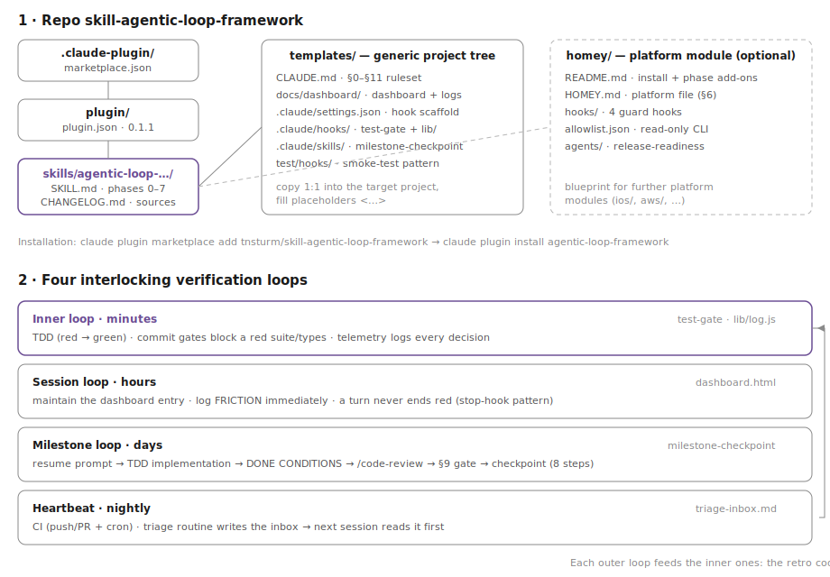

# skill-agentic-loop-framework

*English · [Deutsche Version](README.md)*

Portable Claude Code skill: **bootstraps a loop-driven agentic development framework**
in any repository — verified, self-correcting loops instead of prompt-by-prompt work.
Extracted from the VioletApp project (loop-hardening series M4.6–M4.9, 2026-07).

## What the framework does

The skill sets up four interlocking verification loops — each outer level catches what
the inner one lets through, and the retrospective codifies recurring friction permanently
as a hook, rule, or memory:

1. **Inner loop (minutes):** TDD plus deterministic commit gates — a red test suite or
   red types cannot be committed (`test-gate`); every gate decision is recorded as
   telemetry in `hook-log.jsonl`.
2. **Session loop (hours):** A self-documenting single-file dashboard (milestone status +
   complete resume prompts), friction is logged immediately as a `FRICTION:` entry, and
   a turn must not end in a red state (stop-hook pattern).
3. **Milestone loop (days):** Every milestone has a resume prompt with a machine-checkable
   done condition, ends with `/code-review` + an explicit push gate, and between
   milestones the `milestone-checkpoint` skill runs (8 steps: permissions, automation
   recommendations, skill sources, workflow retro, memory consolidation, framework drift
   check, dashboard, handover).
4. **Heartbeat (nightly):** CI on push/PR plus cron, and a local triage routine that
   writes findings into a committed inbox — the next session reads it first.



## Installation

```
claude plugin marketplace add tnsturm/skill-agentic-loop-framework
claude plugin install agentic-loop-framework
```

`claude plugin marketplace add` accepts the GitHub shorthand (`owner/repo`) as well as
arbitrary git URLs and local paths.

## Initiating the bootstrap

Start a fresh session in the (new or existing) project folder and paste this — the
context lines pre-answer the questions from the SKILL.md's "Vorab klären" section:

```
Set up the agentic-loop framework in this repository — use the agentic-loop-framework
skill and work through its phases 0–7 strictly in order.

Context:
- Project: NEW — <purpose, language/stack>      (or: EXISTING — no Claude setup yet)
- Team: solo                                     (or: shared — skill distributed as plugin)
- Language of all generated artifacts: en        (or: de)
- Bootstrap commits: directly on main            (or: branch bootstrap/agentic-loop)
- Platform: none                                 (or: Homey — include the homey/ module)

Commit after each phase individually, ask me only at the marked DECISION POINTS,
and print a resume prompt after phase 2 and phase 5.
```

**Without installing the plugin** (e.g. someone else's machine, one-off bootstrap):
clone this repo and tell the session: "Follow `plugin/skills/agentic-loop-framework/SKILL.md`
and set up the agentic-loop framework in this project." — plus the same context lines.

Deliberately few questions remain: milestone scoping (phase 2, brainstorming), selecting
the automation recommendations (phase 4), and for existing projects with a slow suite the
commit-gate subset (phase 3).

## Contents

- `plugin/skills/agentic-loop-framework/SKILL.md` — the bootstrap guide (phases 0–7 + standing rules).
- `plugin/skills/agentic-loop-framework/templates/` — copyable generic project tree
  (CLAUDE.md base, dashboard, settings.json scaffold, test-gate hook + telemetry helpers +
  smoke test, milestone-checkpoint skill).
- `plugin/skills/agentic-loop-framework/homey/` — platform module for Homey apps
  (HOMEY.md, 4 guard hooks, allowlist, release-readiness subagent) — also the blueprint
  for further platform modules.
- `plugin/skills/agentic-loop-framework/CHANGELOG.md` — versions + sources.

Historical seed: the bootstrap prompts (as of 2026-07-07) — since 2026-07-09 only in the
git history of `skill-ClaudeCode-general-settings` (`fcbda47`); the living source is this
repo. The SKILL.md itself is German; its phase structure and the templates are
language-neutral, and the bootstrap prompt above works in English sessions.
