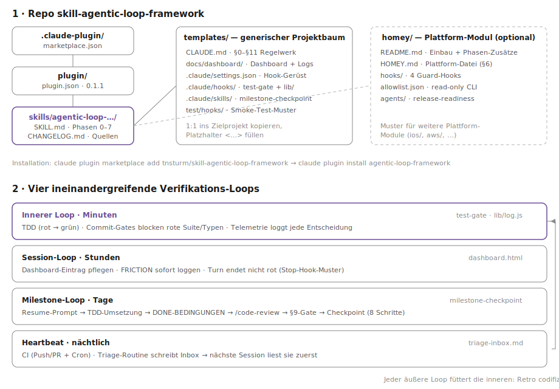

# skill-agentic-loop-framework

*Deutsch · [English version](README.en.md)*

Portabler Claude-Code-Skill: **Bootstrap eines loop-getriebenen agentischen
Entwicklungs-Frameworks** in einem beliebigen Repo — verifizierte, selbstkorrigierende
Loops statt Prompt-für-Prompt-Arbeit. Extrahiert aus dem VioletApp-Projekt
(Loop-Hardening-Reihe M4.6–M4.9, 2026-07).

## Was das Framework tut

Der Skill richtet in einem Projekt vier ineinandergreifende Verifikations-Loops ein —
jede Ebene fängt, was die innere durchlässt, und die Retro codifiziert Reibung dauerhaft
als Hook, Regel oder Memory:

1. **Innerer Loop (Minuten):** TDD plus deterministische Commit-Gates — eine rote
   Testsuite oder rote Typen können nicht committet werden (`test-gate`); jede
   Gate-Entscheidung landet als Telemetrie in `hook-log.jsonl`.
2. **Session-Loop (Stunden):** Ein selbst-dokumentierendes Single-File-Dashboard
   (Milestone-Status + vollständige Resume-Prompts), Reibung wird sofort als
   `FRICTION:`-Eintrag geloggt, und ein Turn darf nicht mit rotem Stand enden
   (Stop-Hook-Muster).
3. **Milestone-Loop (Tage):** Jeder Milestone hat einen Resume-Prompt mit
   maschinell prüfbarer Done-Bedingung, endet mit `/code-review` + explizitem
   Push-Gate, und zwischen Milestones läuft der `milestone-checkpoint`-Skill
   (8 Schritte: Permissions, Automation-Empfehlungen, Skill-Quellen, Workflow-Retro,
   Memory-Konsolidierung, Framework-Drift-Check, Dashboard, Handover).
4. **Heartbeat (nächtlich):** CI bei Push/PR plus Cron, dazu eine lokale
   Triage-Routine, die Befunde in eine committete Inbox schreibt — die nächste
   Session liest sie zuerst.



## Installation

```
claude plugin marketplace add tnsturm/skill-agentic-loop-framework
claude plugin install agentic-loop-framework
```

`claude plugin marketplace add` akzeptiert neben der GitHub-Kurzform (`owner/repo`)
auch beliebige Git-URLs und lokale Pfade.

## Bootstrap initiieren

Im (neuen oder bestehenden) Projektordner eine frische Session starten und pasten —
die Kontextzeilen beantworten vorab die Fragen aus dem „Clarify up front"-Abschnitt der
SKILL.md:

```
Richte in diesem Repository das Agentic-Loop-Framework ein — nutze den Skill
agentic-loop-framework und arbeite dessen Phasen 0–7 strikt nacheinander ab.

Kontext:
- Projekt: NEU — <Zweck, Sprache/Stack>        (oder: BESTAND — bisher ohne Claude)
- Team: solo                                    (oder: geteilt — Skill wird als Plugin verteilt)
- Sprache aller erzeugten Artefakte: de         (oder: en)
- Bootstrap-Commits: direkt auf main            (oder: Branch bootstrap/agentic-loop)
- Plattform: keine                              (oder: Homey — homey/-Modul mit einbauen)

Committe nach jeder Phase einzeln, frage mich nur an den markierten
ENTSCHEIDUNGSPUNKTEN, und gib nach Phase 2 und Phase 5 einen Resume-Prompt aus.
```

**Ohne Plugin-Installation** (z. B. fremder Rechner, Einmal-Bootstrap): dieses Repo klonen
und der Session sagen: „Folge `plugin/skills/agentic-loop-framework/SKILL.md` und richte
das Agentic-Loop-Framework in diesem Projekt ein." — plus dieselben Kontextzeilen.

Es bleiben bewusst wenige Rückfragen: der Milestone-Zuschnitt (Phase 2, Brainstorming),
die Auswahl der Automation-Empfehlungen (Phase 4) und bei Bestandsprojekten mit
langsamer Suite das Commit-Gate-Subset (Phase 3).

## Inhalt

- `plugin/skills/agentic-loop-framework/SKILL.md` — die Bootstrap-Anleitung (Phasen 0–7 + Dauerregeln).
- `plugin/skills/agentic-loop-framework/templates/` — kopierfähiger generischer Projektbaum
  (CLAUDE.md-Basis, Dashboard, settings.json-Gerüst, test-gate-Hook + Telemetrie-Helper +
  Smoke-Test, milestone-checkpoint-Skill).
- `plugin/skills/agentic-loop-framework/homey/` — Plattform-Modul für Homey-Apps
  (HOMEY.md, 4 Guard-Hooks, Allowlist, release-readiness-Subagent) — zugleich die Schablone
  für weitere Plattform-Module.
- `plugin/skills/agentic-loop-framework/CHANGELOG.md` — Versionen + Quellen.

Historischer Seed: die Bootstrap-Prompts (Stand 2026-07-07) — seit 2026-07-09 nur noch in
der Git-Historie von `skill-ClaudeCode-general-settings` (`fcbda47`); die lebende Quelle
ist dieses Repo.
